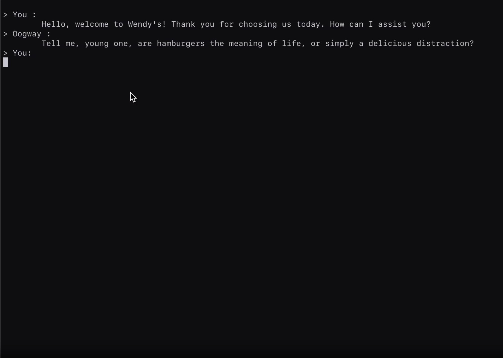

# oogway ai

> get profound knowledged from master oogway 😔

## Run

`OPENAI_API_KEY=<API_KEY> c r --bin cli`

<!---  -->

https://github.com/cs50victor/oogway_ai/assets/52110451/9eaf199d-bffc-449e-a3fa-33e23a66ed33

## develop python package

- `maturin develop -m py/Cargo.toml`
- 

## develop javascript package

- `maturin develop -m py/Cargo.toml`
- 
